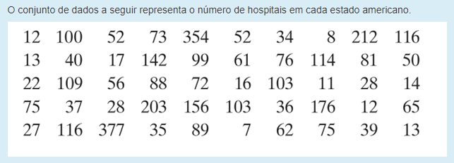

```{r, setup, include=FALSE}
options(prompt = 'R> ', continue = '+ ')
```

```{r configs, echo = FALSE}

# chunk
knitr::opts_chunk$set(
    echo = TRUE
)

# pacotes
library(ggplot2)

```

*Construa um histograma de frequência utilizando 8 classes*

```{r echo = FALSE, out.width = "100%"}


```

Primeiramente, deve-se incluir os dados do exercício:

```{r dados}

data = data.frame(
  n = c(
    12, 100, 52, 73, 354, 52, 34, 8, 212, 116,
    13, 40 ,17, 142, 99, 61, 76, 114, 81, 50,
    22, 109, 56, 88, 72, 16, 103, 11, 28, 14,
    75, 37, 28, 203, 156, 103, 36, 176, 12, 65,
    27, 116, 377, 35, 89, 7, 62, 75, 39, 13
  )
)
```

E então o histograma com 8 classes:

```{r histograma}

data |>
  ggplot(aes(x = n)) +
  geom_histogram(
    bins = 8,
    color = "808080", fill = "#004b8d", alpha = .8) +
  theme_minimal()
```
